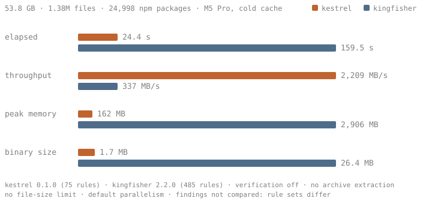

<p align="center">
  
</p>

Kestrel is an ultra-lightweight secret scanner for high-impact credentials, built to scan package registries at scale. It walks a directory tree, emits one JSON line per finding, and exits. ~75 rules are compiled into the binary, each a literal anchor plus a confirming regex: one Aho-Corasick pass over files streamed through a fixed per-thread buffer, regex only on bounded windows around hits, parallel across files. No config, no network, no verification, no dedup. Public keys, JWTs, webhooks and bare UUID/hex tokens are deliberately excluded.

> [!WARNING]
> Kestrel is in very early development. The rule set has been cross-checked against [betterleaks](https://github.com/betterleaks/betterleaks) and benchmarked on 25K npm packages. Expect false positives, missed formats, and breaking changes.

### Installation

Static binaries for Linux (x86_64, aarch64) and macOS (aarch64) are attached to each [release](https://github.com/bzzimmy/kestrel/releases):

```sh
curl -L https://github.com/bzzimmy/kestrel/releases/latest/download/kestrel-x86_64-unknown-linux-musl.tar.gz | tar xz
```

Or build from source:

```sh
cargo install --git https://github.com/bzzimmy/kestrel
```

### Usage

```sh
# Scan a directory tree
kestrel /path/to/dir

# Limit worker threads (default: 4 per core, at least 8, since scanning is I/O-bound)
kestrel /path/to/dir --threads 2

# Skip files larger than 10 MB
kestrel /path/to/dir --max-file-size 10000000
```

Findings go to stdout as JSONL, stats and unreadable-file errors to stderr:

```json
{"path":"batch/left-pad@1.3.0/package/.npmrc","offset":42,"rule":"npm-token","secret":"npm_...","redacted":"npm_...6789"}
```

### Rules

Rules live in [`src/rules/`](src/rules): VCS and registries (GitHub, GitLab, Atlassian, npm, PyPI, crates.io, Docker Hub…), cloud (AWS, GCP, Azure, Cloudflare, Vercel, Supabase, database URIs, private keys…), secret managers (Vault, Terraform Cloud, Doppler, 1Password), SaaS (Slack, Discord, Stripe, Shopify, SendGrid, Sentry…) and AI providers (OpenAI, Anthropic, Gemini, Groq, Together, Fireworks, Hugging Face…).

### Benchmark



Both scanners ran with verification off, archive extraction off and no file-size limit over the same 24,998 randomly sampled npm packages. Findings are not compared: [Kingfisher](https://github.com/mongodb/kingfisher) ships 485 rules including JWTs and generic patterns Kestrel excludes by design. On the rule families both cover, every Kingfisher finding was reviewed and Kestrel matches or exceeds it.

### Contributing

See [CONTRIBUTING.md](CONTRIBUTING.md). Licensed under [MIT](LICENSE).
